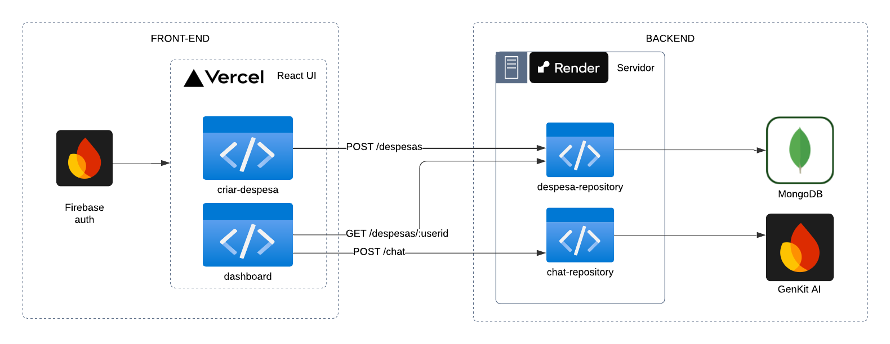

# API de Gestão de Despesas e Chat com Google GenAI

# Sumário
* [1. Introdução](#1-introdução)
    * [1.1. Tecnologias](#11-tecnologias)
* [2. Inicializar a Aplicação ](#2-inicializar-a-aplicação)
* [3. Arquitetura da Aplicação](#3-arquitetura-da-aplicação)
* [Estrutura do Projeto](#estrutura-do-projeto)


## 1. Introdução 

### Projeto Backend - Gestão de Despesas e Chat com Google GenAI

Este projeto backend foi desenvolvido com Node.js e TypeScript, utilizando arquitetura limpa. Ele permite gerenciar despesas de pessoas usuárias e integrar funcionalidades de chat com Gemini.

## 1.1. Tecnologias

A API foi desenvolvida utilizando as seguintes tecnologias:

- [Node.js](https://nodejs.org/en)
- [Express](https://expressjs.com/)
- [Insomnia](https://insomnia.rest/download)
- [IDE VSCODE](https://code.visualstudio.com/download)
- [TypeScript](https://www.typescriptlang.org/)
- [MongoDB](https://www.mongodb.com/pt-br) 
---
# 2. Inicializar a Aplicação 
### Testando a API 

Os passos necessários para testar localmente são:

- Instalar as ferramentas necessárias
- Clonar o projeto 
  ```plaintext
        git clone https://github.com/heloisebastos/Projeto-Final-PretaLab.git
    ```
- Entrar no diretório
    ```
    cd Projeto-Final-PretaLab
    ```
- Executar o seguintes comandos na raiz do diretório


  - Instalar o Express
    ````
    npm install express
    ````
  - Executa o script start definido no package.json, utilizado para rodar a aplicação. 
    ```plaintext
        npm  start
    ```


-----------------------------------------------
## 3. Arquitetura da aplicação




## Funcionalidades

### Rotas

1. **Cadastro de Despesas**  
   - **Endpoint:** `POST /despesas`  
   - **Descrição:** Adiciona uma nova despesa para uma pessoa usuária.  
   - **Request Body:**  
     ```json
     {
        "descricao": "Petshop",
        "categoria": "Pet",
        "valor": "500.00",
        "tipo": "saída",
        "data": "2025-01-04",
        "userId": "Vlrhh7VMtJMtjgQOj5SUHEd2iIC3"
     }
     ```
   - **Resposta:**  
     ```json
     {
        "descricao": "Petshop",
        "categoria": "Pet",
        "valor": "500.00",
        "tipo": "saída",
        "data": "2025-01-04",
        "userId": "Vlrhh7VMtJMtjgQOj5SUHEd2iIC3"
     }
     ```

2. **Listagem de Despesas por pessoa usuária**
   - **Endpoint:** `GET /despesas/:userId`  
   - **Descrição:** Retorna todas as despesas cadastradas de uma pessoa usuária específica.  
   - **Parâmetros de Rota:**  
     - `userId` (string): ID da pessoa usuária.  
   - **Resposta:**  
     ```json
        [
            {
                "id": "677c6da1036bde0695267e8e",
                "descricao": "Salário",
                "categoria": "Trabalho",
                "valor": 10000,
                "tipo": "entrada",
                "data": "2025-01-04",
                "userId": "Vlrhh7VMtJMtjgQOj5SUHEd2iIC3"
            },
            {
                "id": "677c6db8036bde0695267e90",
                "descricao": "Aluguel",
                "categoria": "Moradia",
                "valor": 2000,
                "tipo": "saída",
                "data": "2025-01-05",
                "userId": "Vlrhh7VMtJMtjgQOj5SUHEd2iIC3"
            },
            {
                "id": "677c6dce036bde0695267e92",
                "descricao": "Compra no supermercado",
                "categoria": "Alimentação",
                "valor": 500,
                "tipo": "saída",
                "data": "2025-01-04",
                "userId": "Vlrhh7VMtJMtjgQOj5SUHEd2iIC3"
            }
        ]
     ```

3. **Abrir Chat**  
   - **Endpoint:** `POST /chat`  
   - **Descrição:** Inicia uma sessão de chat utilizando a API do Google GenAI.  
   - **Request Body:**  
     ```json
     {
       "uid": "string",
       "message": "string"
     }
     ```
   - **Resposta:**  
     ```json
     {
        "sessionId": "f557886d-46dd-46e4-99e1-430aa8299079",
        "userId": "Vlrhh7VMtJMtjgQOj5SUHEd2iIC3",
        "messages": [
            {
                "content": "Seu saldo atual é de R$ 7.000,00.\n\nCálculo:\nEntrada total: R$ 10.000,00 (Salário)\nSaída total: R$ 2.000,00 (Aluguel) + R$ 500,00 (Supermercado) + R$ 500,00 (Petshop) = R$ 3.000,00\nSaldo: R$ 10.000,00 - R$ 3.000,00 = R$ 7.000,00\n",
                "timestamp": "2025-01-11T14:17:11.968Z"
            }
        ]
     }
     ```

---

## Configuração

### Dependências

As principais dependências do projeto incluem:

- **Express**: Framework para APIs.  
- **TypeScript**: Superconjunto de JavaScript com tipagem estática.  
- **Mongoose**: ORM para MongoDB.  
- **dotenv**: Gerenciamento de variáveis de ambiente.  
- **@genkit-ai/googleai**: Integração com a API do Google GenAI.  
- **cors**: Middleware para lidar com CORS.


## Design de código e organização das pastas

### Clean Architecture no Projeto

A **Clean Architecture** foi aplicada no projeto para garantir uma separação clara de responsabilidades e facilitar a manutenção, escalabilidade e testabilidade do sistema. A arquitetura é dividida em camadas que se comunicam de forma desacoplada:

1. **Camada de Interface**: Responsável por interagir com o usuário, como os controladores de API (`chat-controller`, `despesa-controller`).
2. **Camada de Aplicação**: Contém os casos de uso e regras de negócio, como `create-chat-use-case` e `create-despesa-use-case`.
3. **Camada de Domínio**: Define os modelos de dados, como a entidade `Despesa`.
4. **Camada de Infraestrutura**: Implementa a persistência dos dados e integrações externas, como os repositórios de `chat` e `despesa`.

### Inversão de Injeção de Dependência

A **Inversão de Injeção de Dependências** é uma prática que visa desacoplar componentes do sistema, onde as dependências são injetadas em vez de serem criadas diretamente nas classes. Isso é alcançado no projeto através de um mecanismo de injeção de dependências usada para passar instâncias de casos de uso e repositórios para os controladores (`chatController`, `despesaController`).

-------------
## Estrutura do Projeto
````
📂api-gerenciamento-de-despesas
 └───src/
      ├── application/
      │   ├── repositories/
      │   │   ├── chat-repository.ts
      │   │   └── despesa-repository.ts
      │   ├── usecases/
      │   │   ├── create-chat-use-case.ts
      │   │   ├── create-despesa-use-case.ts
      │   │   └── get-despesas-by-user-use-case.ts
      ├── domain/
      │   └── despesa.ts
      ├── infrastructure/
      │   ├── database/
      │   │   ├── connection.ts
      │   │   ├── model.ts
      │   │   └── repository.ts
      │   ├── genai/
      │   │   ├── connection.ts
      │   │   └── repository.ts
      │   └── utils/
      │       └── config.ts
      ├── interface/
      │   ├── chat-controller.ts
      │   ├── despesa-controller.ts
      │   └── index.ts

````
